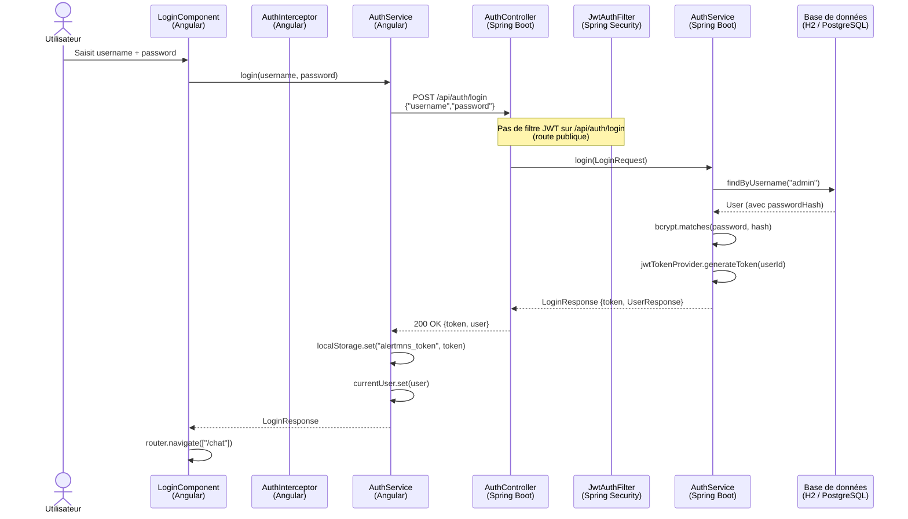
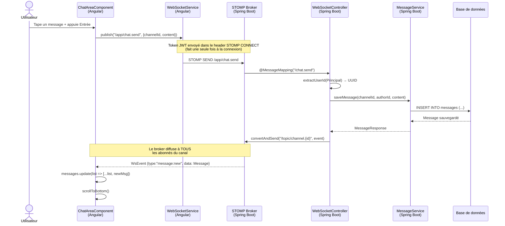
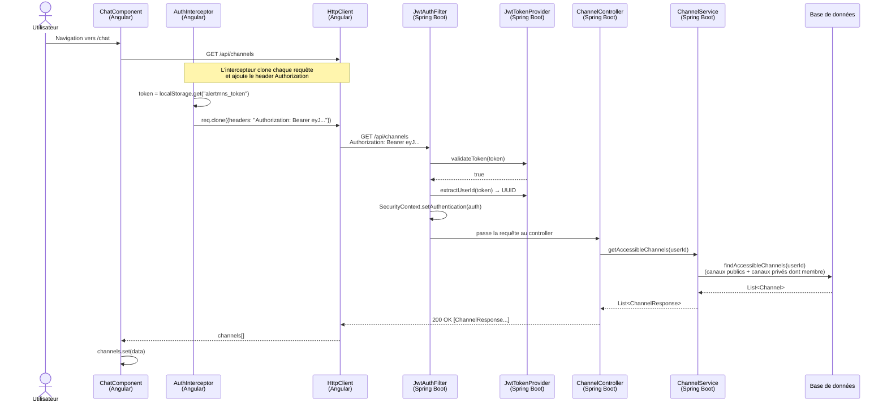
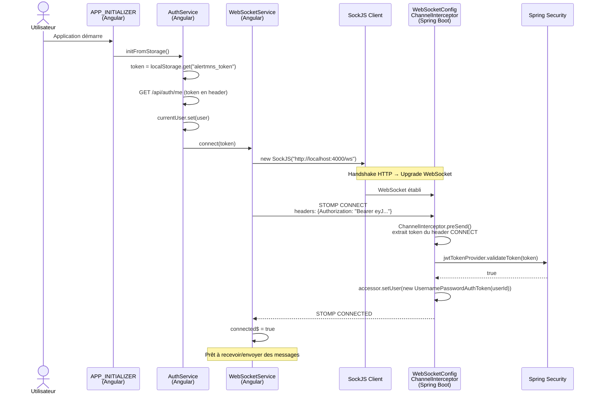

# DOCUMENTATION TECHNIQUE — AlertMNS
## Migration Java Spring Boot 3 + Angular 17

> **Auteur** : Lead Dev & Architecte  
> **Date** : 2026-06-12 (mis à jour)  
> **Version** : 1.1.0  
> **Stack originale** : Node.js + Express + React 18 + Socket.io  
> **Stack cible** : Java 21 + Spring Boot 3.3 + Angular 17 + STOMP WebSocket  

---

## TABLE DES MATIÈRES

1. [Vue d'ensemble de l'architecture](#1-vue-densemble-de-larchitecture)
2. [Structure des projets](#2-structure-des-projets)
3. [Backend — Spring Boot](#3-backend--spring-boot)
   - 3.1 [pom.xml — Dépendances Maven](#31-pomxml--dépendances-maven)
   - 3.2 [application.properties — Configuration](#32-applicationproperties--configuration)
   - 3.3 [Modèles JPA (Entités)](#33-modèles-jpa-entités)
   - 3.4 [Repositories Spring Data JPA](#34-repositories-spring-data-jpa)
   - 3.5 [DTOs (Data Transfer Objects)](#35-dtos-data-transfer-objects)
   - 3.6 [Sécurité — Spring Security 6 + JWT](#36-sécurité--spring-security-6--jwt)
   - 3.7 [Services Métier](#37-services-métier)
   - 3.8 [Contrôleurs REST](#38-contrôleurs-rest)
   - 3.9 [WebSocket STOMP](#39-websocket-stomp)
   - 3.10 [Gestion des erreurs](#310-gestion-des-erreurs)
   - 3.11 [Initialisation des données](#311-initialisation-des-données)
4. [Frontend — Angular 17](#4-frontend--angular-17)
   - 4.1 [Architecture Angular Standalone](#41-architecture-angular-standalone)
   - 4.2 [Modèles TypeScript](#42-modèles-typescript)
   - 4.3 [Services Angular](#43-services-angular)
   - 4.4 [Intercepteur HTTP JWT](#44-intercepteur-http-jwt)
   - 4.5 [Guard de route](#45-guard-de-route)
   - 4.6 [Composant LoginComponent](#46-composant-logincomponent)
   - 4.7 [Composant ChatComponent](#47-composant-chatcomponent)
   - 4.8 [Composant SidebarComponent](#48-composant-sidebarcomponent)
   - 4.9 [Composant ChatAreaComponent](#49-composant-chatareacomponent)
   - 4.10 [Composant MessageItemComponent](#410-composant-messageitemcomponent)
   - 4.11 [Composant ExportMenuComponent](#411-composant-exportmenucomponent)
5. [Référence API REST](#5-référence-api-rest)
6. [Référence WebSocket STOMP](#6-référence-websocket-stomp)
7. [Modèle de données](#7-modèle-de-données)
8. [Flux d'authentification](#8-flux-dauthentification)
   - 8.1 [Diagrammes de séquence](#81-diagrammes-de-séquence)
9. [Décisions architecturales](#9-décisions-architecturales)
10. [Guide de démarrage](#10-guide-de-démarrage)
11. [Comptes de démonstration](#11-comptes-de-démonstration)
12. [Sécurité — corrections appliquées](#12-sécurité--corrections-appliquées)
13. [Tests unitaires](#13-tests-unitaires)
14. [Infrastructure & Déploiement](#14-infrastructure--déploiement)
15. [Thème dark / light](#15-thème-dark--light)

---

## 1. Vue d'ensemble de l'architecture

```
┌─────────────────────────────────────────────────────────────────┐
│                     Client — Angular 17                         │
│  ┌─────────────┐  ┌──────────────┐  ┌────────────────────────┐  │
│  │  LoginPage  │  │ ChatComponent│  │ WebSocket Service      │  │
│  │             │  │  ├ Sidebar   │  │ (@stomp/rx-stomp)      │  │
│  │  AuthService│  │  └ ChatArea  │  │  STOMP over SockJS     │  │
│  └─────────────┘  └──────────────┘  └────────────────────────┘  │
│         │                │                       │               │
│    HTTP + JWT       HTTP + JWT              STOMP + JWT          │
└──────────┼──────────────────────────────────────┼───────────────┘
           │                                       │
           ▼                                       ▼
┌─────────────────────────────────────────────────────────────────┐
│                   Serveur — Spring Boot 3.3                      │
│                                                                 │
│  ┌──────────────────────────────────────────────────────────┐   │
│  │              Spring Security 6 (JWT Filter)              │   │
│  └──────────────────────────────────────────────────────────┘   │
│                                                                 │
│  ┌──────────────┐  ┌──────────────┐  ┌───────────────────────┐  │
│  │ REST         │  │  WebSocket   │  │  Spring Security      │  │
│  │ Controllers  │  │  Controller  │  │  JwtTokenProvider     │  │
│  │ /api/**      │  │  STOMP       │  │  JwtAuthFilter        │  │
│  └──────┬───────┘  └──────┬───────┘  └───────────────────────┘  │
│         │                 │                                      │
│  ┌──────▼──────────────────▼──────────────────────────────────┐  │
│  │                     Services                               │  │
│  │  AuthService  ChannelService  MessageService  UserService  │  │
│  └──────────────────────────────┬─────────────────────────────┘  │
│                                 │                                │
│  ┌──────────────────────────────▼─────────────────────────────┐  │
│  │              Spring Data JPA / Hibernate                   │  │
│  │  UserRepo  ChannelRepo  MessageRepo  DirectConvRepo        │  │
│  └──────────────────────────────┬─────────────────────────────┘  │
│                                 │                                │
│  ┌──────────────────────────────▼─────────────────────────────┐  │
│  │              H2 In-Memory Database                         │  │
│  │         (remplaçable par PostgreSQL sans refactor)         │  │
│  └────────────────────────────────────────────────────────────┘  │
└─────────────────────────────────────────────────────────────────┘
```

**Principes clés :**
- Séparation stricte Controller → Service → Repository (pas de logique dans les controllers)
- Stateless : zéro session HTTP côté serveur, authentification 100% JWT
- STOMP remplace Socket.io pour le temps réel (protocole standardisé)
- Les DTOs isolent l'API des entités JPA (le `passwordHash` ne sort jamais)
- Angular Standalone Components (pas de NgModule)
- Signals Angular 17 pour la réactivité (remplacement moderne des Observables pour l'état local)

---

## 2. Structure des projets

```
alertmns/
├── DOCUMENTATION.md                          ← Ce fichier
│
├── alertmns-backend/                         ← Projet Maven Spring Boot
│   ├── pom.xml
│   └── src/main/
│       ├── java/com/alertmns/
│       │   ├── AlertMnsApplication.java       ← Point d'entrée
│       │   ├── config/
│       │   │   ├── DataInitializer.java       ← Seed données démo
│       │   │   ├── JacksonConfig.java         ← Config JSON (dates ISO-8601)
│       │   │   ├── SecurityConfig.java        ← Spring Security 6
│       │   │   └── WebSocketConfig.java       ← STOMP + auth WebSocket
│       │   ├── model/
│       │   │   ├── enums/
│       │   │   │   ├── UserRole.java          ← ADMIN | MANAGER | USER
│       │   │   │   └── UserStatus.java        ← ONLINE | AWAY | OFFLINE
│       │   │   ├── User.java                  ← Entité utilisateur
│       │   │   ├── Channel.java               ← Entité canal
│       │   │   ├── Message.java               ← Entité message
│       │   │   └── DirectConversation.java    ← Entité conversation DM
│       │   ├── dto/
│       │   │   ├── request/                   ← Payloads entrants (validés)
│       │   │   └── response/                  ← Payloads sortants (sans data sensible)
│       │   ├── repository/                    ← Interfaces Spring Data JPA
│       │   ├── service/                       ← Logique métier transactionnelle
│       │   ├── controller/                    ← Endpoints REST + GlobalExceptionHandler
│       │   ├── websocket/                     ← Handlers STOMP temps réel
│       │   └── security/                      ← JWT Provider + Filter + UserDetailsService
│       └── resources/
│           └── application.properties
│
└── alertmns-frontend/                        ← Projet Angular 17
    ├── angular.json
    ├── package.json
    ├── proxy.conf.json                        ← Proxy dev (→ localhost:4000)
    ├── tsconfig.json
    └── src/
        ├── main.ts                            ← bootstrapApplication
        ├── styles.scss                        ← Styles globaux
        ├── environments/
        │   ├── environment.ts                 ← Dev (proxy)
        │   └── environment.prod.ts            ← Production
        └── app/
            ├── app.component.ts               ← Root component (<router-outlet>)
            ├── app.config.ts                  ← Providers (router, http, init)
            ├── app.routes.ts                  ← Routes lazy-loaded
            ├── core/
            │   ├── models/                    ← Interfaces TypeScript (User, Channel, Message)
            │   ├── services/                  ← Services injectables
            │   ├── guards/                    ← auth.guard.ts
            │   └── interceptors/              ← auth.interceptor.ts
            └── features/
                ├── auth/login/                ← LoginComponent
                └── chat/
                    ├── chat.component         ← Shell orchestrateur
                    ├── sidebar/               ← SidebarComponent
                    ├── chat-area/             ← ChatAreaComponent
                    ├── message-item/          ← MessageItemComponent
                    └── export-menu/           ← ExportMenuComponent
```

---

## 3. Backend — Spring Boot

### 3.1 `pom.xml` — Dépendances Maven

| Dépendance | Version | Rôle |
|---|---|---|
| `spring-boot-starter-web` | 3.3.2 | REST API, Jackson, Tomcat embarqué |
| `spring-boot-starter-security` | 3.3.2 | Spring Security 6, filtres HTTP |
| `spring-boot-starter-websocket` | 3.3.2 | STOMP over WebSocket |
| `spring-boot-starter-data-jpa` | 3.3.2 | Hibernate ORM, Spring Data repositories |
| `spring-boot-starter-validation` | 3.3.2 | Bean Validation (Jakarta) |
| `h2` | runtime | Base de données in-memory (dev/démo) |
| `jjwt-api/impl/jackson` | 0.12.6 | Création/validation JWT HMAC-SHA256 |
| `lombok` | optional | Réduction du boilerplate (@Getter, @Builder…) |

> **Pourquoi JJWT 0.12 ?**  
> L'API 0.12 est fluente, immutable et compatible Java 21. L'ancienne API (0.9.x) est dépréciée et ne supporte pas la nouvelle norme JOSE.

> **Pourquoi H2 ?**  
> Fidélité à l'application originale (base in-memory). Passer à PostgreSQL ne nécessite que changer le driver et l'URL dans `application.properties` — les entités JPA sont identiques.

---

### 3.2 `application.properties` — Configuration

```properties
server.port=4000                          # Même port que l'app Node.js originale
spring.datasource.url=jdbc:h2:mem:alertmns
spring.jpa.hibernate.ddl-auto=create-drop # Recréation du schéma au démarrage

app.jwt.secret=...                        # Min 32 chars — CHANGER EN PROD
app.jwt.expiration-ms=604800000           # 7 jours (7 × 24 × 3600 × 1000)
app.cors.allowed-origins=http://localhost:4200
```

**Important en production :**
- Remplacer `app.jwt.secret` par une valeur aléatoire forte (256 bits minimum)
- Passer `spring.jpa.hibernate.ddl-auto=validate` ou `none` avec une migration Flyway/Liquibase
- Désactiver la console H2 (`spring.h2.console.enabled=false`)

---

### 3.3 Modèles JPA (Entités)

#### `User.java`

```java
@Entity
@Table(name = "users", uniqueConstraints = {
    @UniqueConstraint(columnNames = "username"),
    @UniqueConstraint(columnNames = "email")
})
```

| Champ | Type SQL | Rôle |
|---|---|---|
| `id` | UUID (PK) | Généré par Hibernate (`@UuidGenerator`) |
| `username` | VARCHAR(50) UNIQUE | Identifiant de connexion |
| `email` | VARCHAR(100) UNIQUE | Email unique |
| `passwordHash` | VARCHAR | Hash bcrypt (jamais retourné dans l'API) |
| `displayName` | VARCHAR(100) | Nom affiché dans l'interface |
| `initials` | VARCHAR(5) | Initiales pour l'avatar (ex: "SM") |
| `role` | ENUM | ADMIN / MANAGER / USER |
| `status` | ENUM | ONLINE / AWAY / OFFLINE |
| `absentUntil` | DATE | Date de retour (mode AWAY) |
| `absentMessage` | VARCHAR(500) | Message d'absence |
| `color` | VARCHAR(20) | Couleur hex de l'avatar (ex: "#e74c3c") |
| `createdAt` | TIMESTAMP | Immuable, défaut = `Instant.now()` |

> **Lombok** : `@Getter @Setter @NoArgsConstructor @AllArgsConstructor @Builder`  
> `@Builder.Default` est nécessaire sur les champs avec valeur par défaut dans un builder Lombok.

#### `Channel.java`

| Champ | Type SQL | Rôle |
|---|---|---|
| `id` | UUID (PK) | Généré |
| `name` | VARCHAR(100) UNIQUE | Nom du canal (ex: "general") |
| `description` | VARCHAR(500) | Description optionnelle |
| `isPrivate` | BOOLEAN | false=public, true=accès restreint |
| `members` | `@ManyToMany` | Table `channel_members` |
| `createdBy` | UUID | UUID du créateur (pas de FK pour simplicité) |
| `createdAt` | TIMESTAMP | Immuable |

La relation `members` est `FetchType.LAZY` : les membres ne sont chargés que si explicitement accédés, évitant les jointures inutiles sur les listings de canaux.

#### `Message.java`

| Champ | Type SQL | Rôle |
|---|---|---|
| `id` | UUID (PK) | Généré |
| `channelId` | UUID | Référence au canal (pas de FK — voir note) |
| `author` | `@ManyToOne` | Jointure sur `users.id` |
| `content` | TEXT | Contenu du message |
| `reactionsJson` | TEXT | JSON : `{"👍":["uuid1"],"❤️":["uuid2"]}` |
| `createdAt` | TIMESTAMP | Immuable |
| `editedAt` | TIMESTAMP | NULL si non modifié |

> **Pourquoi `channelId` sans FK ?**  
> Les messages DM et les messages de canaux partagent la même table. Un `DirectConversation` a un `id` UUID utilisé comme `channelId` des messages. Une FK stricte compliquerait cette modélisation unifiée.

> **Pourquoi JSON pour les réactions ?**  
> Une table séparée `message_reactions(message_id, emoji, user_id)` serait plus normalisée mais moins performante pour les lectures. Le JSON est désérialisé à la demande dans `MessageResponse.from()`.

#### `DirectConversation.java`

Représente une conversation 1-on-1 entre deux utilisateurs. Son `id` est utilisé comme `channelId` dans la table `messages`, unifiant ainsi la récupération des messages.

---

### 3.4 Repositories Spring Data JPA

Spring Data génère automatiquement l'implémentation SQL à partir des signatures de méthodes.

#### `UserRepository`
```java
Optional<User> findByUsername(String username);     // login
boolean existsByUsername(String username);           // vérification unicité inscription
boolean existsByEmail(String email);                 // vérification unicité inscription
```

#### `ChannelRepository`
```java
@Query("SELECT DISTINCT c FROM Channel c LEFT JOIN c.members m
        WHERE c.isPrivate = false OR m.id = :userId ORDER BY c.name")
List<Channel> findAccessibleChannels(UUID userId);
```
Cette requête JPQL couvre les deux cas : canal public **ou** canal privé dont l'utilisateur est membre. `DISTINCT` élimine les doublons causés par la jointure.

#### `MessageRepository`
```java
@Query("SELECT m FROM Message m JOIN FETCH m.author
        WHERE m.channelId = :channelId ORDER BY m.createdAt ASC")
List<Message> findByChannelIdOrderByCreatedAtAsc(UUID channelId, Pageable pageable);
```
`JOIN FETCH m.author` résout le **problème N+1** : sans cela, Hibernate exécuterait une requête SQL par message pour charger l'auteur. Avec `FETCH`, un seul `JOIN` charge tout en une requête.

---

### 3.5 DTOs (Data Transfer Objects)

Les DTOs sont des **Java Records** (immutables depuis Java 16). Ils servent à :

1. **Sécuriser l'API** : `UserResponse` n'a pas de champ `passwordHash`
2. **Valider les entrées** : annotations Bean Validation (`@NotBlank`, `@Email`, `@Size`)
3. **Découpler** l'API des entités JPA (les entités peuvent évoluer sans casser l'API)

**DTOs Request (entrants) :**

| Classe | Endpoint | Champs principaux |
|---|---|---|
| `LoginRequest` | POST /api/auth/login | username, password |
| `RegisterRequest` | POST /api/auth/register | username, email, password, displayName |
| `UpdateProfileRequest` | PATCH /api/auth/me | displayName?, status?, absentUntil?, absentMessage? |
| `CreateChannelRequest` | POST /api/channels | name, description?, isPrivate |
| `UpdateMembersRequest` | PATCH /api/channels/{id}/members | action (add/remove), userIds |
| `EditMessageRequest` | PATCH /api/messages/{id} | content |
| `ReactRequest` | POST /api/messages/{id}/react | emoji |
| `UpdateRoleRequest` | PATCH /api/users/{id}/role | role |

**DTOs Response (sortants) :**

| Classe | Méthode `from()` | Champs |
|---|---|---|
| `UserResponse` | `UserResponse.from(User)` | id, username, email, displayName, initials, role, status, absentUntil, absentMessage, color |
| `LoginResponse` | — | token (JWT), user (UserResponse) |
| `ChannelResponse` | `ChannelResponse.from(Channel)` | id, name, description, isPrivate, memberIds, createdBy, createdAt |
| `MessageResponse` | `MessageResponse.from(Message)` | id, channelId, author (UserResponse), content, reactions (Map), createdAt, editedAt |
| `ErrorResponse` | `ErrorResponse.of(status, message)` | status, message, timestamp |

> **Convention** : chaque DTO Response expose une méthode statique `from(Entity)` pour la conversion. Ce pattern évite d'avoir des mappers dispersés dans les controllers et services.

---

### 3.6 Sécurité — Spring Security 6 + JWT

#### Architecture de la chaîne de sécurité

```
Requête HTTP entrante
       │
       ▼
JwtAuthenticationFilter (OncePerRequestFilter)
  ├── Extrait "Bearer {token}" du header Authorization
  ├── Valide le token (JwtTokenProvider.validateToken)
  ├── Charge l'UserDetails (UserDetailsServiceImpl)
  └── Injecte UsernamePasswordAuthenticationToken dans SecurityContext
       │
       ▼
SecurityFilterChain (SecurityConfig)
  ├── /api/auth/login, /api/auth/register → PERMIT_ALL
  ├── /ws/** → PERMIT_ALL (auth STOMP gérée séparément)
  └── toute autre requête → AUTHENTICATED
       │
       ▼
Controller → @AuthenticationPrincipal UserDetails
```

#### `JwtTokenProvider`

```java
// Génération
Jwts.builder().subject(userId).issuedAt(now).expiration(expiry).signWith(secretKey).compact()

// Validation
Jwts.parser().verifyWith(secretKey).build().parseSignedClaims(token)
```

- Algorithme : **HMAC-SHA256** (HS256)
- La clé secrète est encodée en Base64 puis wrappée en `SecretKey` via `Keys.hmacShaKeyFor()`
- Durée d'expiration configurable (défaut 7 jours = 604 800 000 ms)

#### `UserDetailsServiceImpl`

```java
loadUserByUsername(String userId) // userId = UUID.toString()
```

Le "username" Spring Security est l'UUID de l'utilisateur, pas son login textuel. Cela garantit que le token reste valide même si l'utilisateur change de username.

Les autorités retournées ont le préfixe `ROLE_` (convention Spring Security) :
- `ROLE_ADMIN`, `ROLE_MANAGER`, `ROLE_USER`

Ces rôles permettent d'utiliser `@PreAuthorize("hasRole('ADMIN')")` sur les méthodes de service si nécessaire (activé par `@EnableMethodSecurity`).

#### `SecurityConfig`

Points clés :
- **`SessionCreationPolicy.STATELESS`** : aucune session HTTP créée — authentification uniquement par JWT
- **CSRF désactivé** : inutile sans cookie de session (JWT dans header Authorization)
- **CORS configuré** : origins autorisées lues depuis `app.cors.allowed-origins`
- **`frameOptions().disable()`** : nécessaire pour accéder à la console H2 dans une iframe (dev uniquement)

---

### 3.7 Services Métier

Tous les services sont annotés `@Service @Transactional`. Les méthodes de lecture utilisent `@Transactional(readOnly = true)` pour permettre à Hibernate d'optimiser (pas de dirty checking, connexions read-replica si configuré).

#### `AuthService`

**`login(LoginRequest)`**
1. `findByUsername(username)` → 404 mappé en 401 (sécurité : ne pas révéler l'existence d'un compte)
2. `passwordEncoder.matches(plainPassword, hash)` → 401 si invalide
3. `jwtTokenProvider.generateToken(user.getId())` → JWT signé
4. Retourne `LoginResponse(token, UserResponse.from(user))`

**`register(RegisterRequest)`**
1. Vérification unicité username + email → 409 Conflict si doublon
2. Génération des initiales à partir du displayName (ex: "Sofia Martin" → "SM")
3. Sélection aléatoire d'une couleur d'avatar dans un tableau de 8 couleurs
4. Hash bcrypt du mot de passe (cost=10, ~100ms par hash — protection brute force)
5. Sauvegarde + token JWT

#### `ChannelService`

**`getAccessibleChannels(userId)`**
Délègue à `ChannelRepository.findAccessibleChannels()`. Un seul appel SQL suffit.

**`createChannel(request, creatorId)`**
Si `isPrivate=true`, le créateur est ajouté aux membres pour ne pas se retrouver exclu de son propre canal.

**`updateMembers(channelId, request, requesterId)`**
Contrôle d'accès : seul le créateur du canal OU un ADMIN peut gérer les membres. Cette règle est vérifiée en service (pas uniquement en controller).

**`deleteChannel(channelId, requesterId)`**
Réservé aux ADMIN uniquement. Vérification du rôle en service.

#### `MessageService`

**`saveMessage(channelId, authorId, content)`**
Crée et persiste le message. Retourne `MessageResponse` qui sera diffusé via WebSocket par `WebSocketController`.

**`toggleReaction(messageId, userId, emoji)`**
- Désérialise le JSON de réactions
- Si l'emoji existe et l'userId est dans la liste → **retrait** (toggle)
- Sinon → **ajout**
- Si la liste d'un emoji devient vide → suppression de l'entrée
- Re-sérialise en JSON et sauvegarde

**`editMessage` / `deleteMessage`**
- Edit : seul l'auteur peut modifier. `editedAt = Instant.now()` mis à jour.
- Delete : l'auteur OU un ADMIN. Double vérification (UI + backend).

#### `UserService`

**`setStatus(userId, status, absentUntil, absentMessage)`**
Appelé par `WebSocketController` lors d'un événement `status.set`. Si le statut n'est pas AWAY, les champs d'absence sont remis à null.

#### `ExportService`

Trois formats gérés en pur Java sans dépendance externe :
- **JSON** : via `ObjectMapper` Jackson avec JavaTimeModule (dates ISO-8601)
- **CSV** : génération StringBuilder avec `escapeCsv()` (gère les virgules et guillemets dans le contenu)
- **XML** : génération StringBuilder avec `escapeXml()` (entités HTML `&amp;`, `&lt;`, etc.)

---

### 3.8 Contrôleurs REST

Tous les contrôleurs suivent le même pattern :

```java
@RestController
@RequestMapping("/api/resource")
@RequiredArgsConstructor
public class ResourceController {

    @GetMapping("/{id}")
    public ResponseEntity<ResourceResponse> get(
            @PathVariable UUID id,
            @AuthenticationPrincipal UserDetails userDetails) {
        return ResponseEntity.ok(service.get(id, extractId(userDetails)));
    }

    private UUID extractId(UserDetails ud) {
        return UUID.fromString(ud.getUsername());
    }
}
```

`@AuthenticationPrincipal UserDetails` est injecté par Spring Security depuis le SecurityContext peuplé par `JwtAuthenticationFilter`. `getUsername()` retourne l'UUID de l'utilisateur (String).

**Codes de retour HTTP :**
- `200 OK` : succès lecture/mise à jour
- `201 Created` : ressource créée (POST login, register, create channel)
- `204 No Content` : suppression réussie
- `400 Bad Request` : validation échouée (@Valid)
- `401 Unauthorized` : token absent ou invalide
- `403 Forbidden` : authentifié mais non autorisé
- `404 Not Found` : ressource inexistante
- `409 Conflict` : doublon (username, email, channel name)
- `500 Internal Server Error` : erreur non gérée

---

### 3.9 WebSocket STOMP

#### Protocole STOMP

STOMP (Simple Text Oriented Messaging Protocol) est une surcouche de messagerie sur WebSocket. Contrairement aux WebSockets bruts (utilisés par Socket.io dans l'app originale), STOMP apporte :

- Un système de **topics** (abonnements) structuré
- L'intégration native avec **Spring Security** (Principal injectable)
- La compatibilité avec le client **@stomp/rx-stomp** Angular
- Un broker simple intégré (pas de RabbitMQ/ActiveMQ nécessaire en dev)

#### Configuration (`WebSocketConfig`)

```
/ws               → endpoint WebSocket (SockJS fallback activé)
/app              → préfixe pour les destinations d'envoi client→serveur
/topic, /queue    → préfixe pour les abonnements
/user             → préfixe pour les messages personnels
```

SockJS est activé pour le fallback : si WebSocket natif n'est pas disponible, SockJS utilise des alternatives (long polling, etc.).

#### Authentification WebSocket

Le JWT est extrait dans un `ChannelInterceptor` lors de la commande STOMP `CONNECT` :

```java
String authHeader = accessor.getFirstNativeHeader("Authorization");
// Valide le JWT → injecte UsernamePasswordAuthenticationToken comme Principal
accessor.setUser(auth);
```

Ainsi, `principal.getName()` dans `WebSocketController` retourne l'UUID de l'utilisateur, exactement comme dans les controllers REST.

#### Topics et destinations

| Type | Direction | Destination | Usage |
|---|---|---|---|
| Abonnement | Serveur→Client | `/topic/channel.{channelId}` | Messages d'un canal |
| Abonnement | Serveur→Client | `/topic/channel.{channelId}.typing` | Indicateurs de frappe |
| Abonnement | Serveur→Client | `/topic/users` | Statuts utilisateurs |
| Abonnement | Serveur→Client | `/user/queue/notifications` | Notifications DM personnelles |
| Envoi | Client→Serveur | `/app/chat.send` | Envoyer un message |
| Envoi | Client→Serveur | `/app/chat.edit` | Modifier un message |
| Envoi | Client→Serveur | `/app/chat.delete` | Supprimer un message |
| Envoi | Client→Serveur | `/app/chat.react` | Réagir à un message |
| Envoi | Client→Serveur | `/app/typing.start` | Début de frappe |
| Envoi | Client→Serveur | `/app/typing.stop` | Fin de frappe |
| Envoi | Client→Serveur | `/app/dm.send` | Envoyer un DM |
| Envoi | Client→Serveur | `/app/status.set` | Changer son statut |

#### Format des événements WebSocket (JSON)

```json
// message:new — diffusé sur /topic/channel.{channelId}
{
  "type": "message:new",
  "data": {
    "id": "uuid",
    "channelId": "uuid",
    "author": { "id": "...", "displayName": "...", ... },
    "content": "Bonjour !",
    "reactions": {},
    "createdAt": "2026-06-09T10:30:00Z",
    "editedAt": null
  }
}

// typing:start — diffusé sur /topic/channel.{channelId}.typing
{
  "type": "typing:start",
  "userId": "uuid-de-l-utilisateur"
}

// user:status — diffusé sur /topic/users
{
  "type": "user:status",
  "data": { "id": "...", "status": "ONLINE", ... }
}
```

---

### 3.10 Gestion des erreurs

`GlobalExceptionHandler` (`@RestControllerAdvice`) centralise la gestion des exceptions :

```java
@ExceptionHandler(ResponseStatusException.class)
// → Retourne ErrorResponse avec le code HTTP de l'exception

@ExceptionHandler(MethodArgumentNotValidException.class)
// → Retourne 400 avec le message de validation de chaque champ invalide

@ExceptionHandler(Exception.class)
// → Catch-all → 500 Internal Server Error (message générique, pas de stack trace exposée)
```

Format de réponse d'erreur :
```json
{
  "status": 409,
  "message": "Username already taken",
  "timestamp": "2026-06-09T10:30:00Z"
}
```

---

### 3.11 Initialisation des données

`DataInitializer` implémente `CommandLineRunner` (exécuté une fois après le démarrage complet).

Guard : `if (userRepository.count() > 0) return;` — évite une double initialisation si l'application redémarre sans recréer la base.

**Données créées :**
- 4 utilisateurs (admin, sofia, marc, lea)
- 4 canaux (general, annonces, dev-team [privé], direction [privé])

---

## 4. Frontend — Angular 17

### 4.1 Architecture Angular Standalone

Angular 17 supporte les **Standalone Components** : chaque composant déclare ses propres imports, sans appartenir à un NgModule.

```typescript
@Component({
  selector: 'app-example',
  standalone: true,                       // ← Clé de l'architecture standalone
  imports: [CommonModule, FormsModule],   // ← Imports directs
  templateUrl: '...',
  styleUrl: '...'
})
export class ExampleComponent {}
```

**`app.config.ts`** remplace le `AppModule` traditionnel et centralise les providers :
```typescript
export const appConfig: ApplicationConfig = {
  providers: [
    provideRouter(routes),
    provideHttpClient(withInterceptors([authInterceptor])),
    provideAnimations(),
    { provide: APP_INITIALIZER, ... }  // Restaure la session JWT au démarrage
  ]
};
```

**Signals Angular 17** (`signal()`, `computed()`, `.update()`) :
- Remplacent les variables d'instance pour l'état local des composants
- Plus performants que les Observables pour les valeurs scalaires simples
- Déclenchent la détection de changements de façon granulaire

---

### 4.2 Modèles TypeScript

Les interfaces TypeScript sont le miroir exact des DTOs Java Response.

```typescript
// user.model.ts
export interface User {
  id: string;           // UUID Java → string TypeScript
  username: string;
  email: string;
  displayName: string;
  initials: string;
  role: 'ADMIN' | 'MANAGER' | 'USER';
  status: 'ONLINE' | 'AWAY' | 'OFFLINE';
  absentUntil?: string;    // LocalDate Java → string ISO (yyyy-MM-dd)
  absentMessage?: string;
  color: string;
}
```

**Convention** : les UUIDs Java sont des `string` TypeScript (pas d'objet UUID en JS).

---

### 4.3 Services Angular

#### `AuthService`

```
Signals :
  currentUser = signal<User | null>(null)

Méthodes :
  login()           → POST /api/auth/login → stocke JWT en localStorage
  register()        → POST /api/auth/register → idem
  updateProfile()   → PATCH /api/auth/me → met à jour currentUser signal
  logout()          → vide localStorage, navigue vers /login
  getToken()        → lit le JWT depuis localStorage
  isLoggedIn()      → !!getToken()
  initFromStorage() → appelé par APP_INITIALIZER au démarrage
```

`APP_INITIALIZER` : Angular exécute cette fonction avant le premier rendu de l'application. Si un JWT valide est en localStorage, l'utilisateur est restauré sans devoir se reconnecter.

#### `ChannelService` / `MessageService` / `UserService`

Services HTTP purs : wrappent les appels `HttpClient` et retournent des `Observable<T>`. Le JWT est injecté automatiquement par `authInterceptor`.

#### `WebSocketService`

Utilise `@stomp/rx-stomp` — une bibliothèque qui expose une API RxJS sur STOMP.

```typescript
connect(): void {
  const config: RxStompConfig = {
    webSocketFactory: () => new SockJS(environment.wsUrl),
    connectHeaders: { Authorization: `Bearer ${token}` },
    reconnectDelay: 5000,  // Reconnexion automatique après 5s
  };
  this.rxStomp.activate();
}

watchChannel(channelId: string): Observable<WsEvent> {
  return this.rxStomp.watch(`/topic/channel.${channelId}`)
    .pipe(map(msg => JSON.parse(msg.body)));
}
```

SockJS est utilisé pour le transport (compatibilité navigateurs sans WebSocket natif).

---

### 4.4 Intercepteur HTTP JWT

```typescript
export const authInterceptor: HttpInterceptorFn = (req, next) => {
  const token = inject(AuthService).getToken();
  if (token) {
    req = req.clone({ setHeaders: { Authorization: `Bearer ${token}` } });
  }
  return next(req);
};
```

**Fonctionnel** (pas de classe) — style Angular 17 moderne. Enregistré via `withInterceptors([authInterceptor])` dans `app.config.ts`.

---

### 4.5 Guard de route

```typescript
export const authGuard: CanActivateFn = () => {
  if (inject(AuthService).isLoggedIn()) return true;
  return inject(Router).createUrlTree(['/login']);
};
```

Protège la route `/chat`. Si non connecté → redirection vers `/login`.

---

### 4.6 Composant `LoginComponent`

**State (Signals) :**
- `isRegisterMode` : toggle login/inscription
- `isLoading` : désactive le bouton pendant la requête
- `error` : message d'erreur affiché sous le formulaire

**Template** : utilise la nouvelle syntaxe Angular 17 `@if`, `@for` (Control Flow) au lieu des directives `*ngIf`, `*ngFor`.

**Flow après succès :**
1. `AuthService.login()` ou `register()` → JWT stocké
2. `WebSocketService.connect()` → connexion STOMP établie
3. `router.navigate(['/chat'])`

---

### 4.7 Composant `ChatComponent`

Composant **orchestrateur** (shell) — ne contient pas de logique d'affichage.

**Responsabilités :**
- Charger les canaux et utilisateurs au `ngOnInit`
- Maintenir `activeChannel` signal
- Relayer les événements WebSocket de statut utilisateur vers le signal `users`
- Passer les données aux composants enfants via `@Input`
- Écouter les événements via `@Output` (channelSelected, logoutRequested, channelsChanged)
- Gérer le **thème dark/light** (signal + `localStorage`)

**Gestion du thème :**
```typescript
isDarkMode = signal<boolean>(localStorage.getItem('theme') !== 'light');

constructor(...) {
  effect(() => {
    document.body.classList.toggle('light-theme', !this.isDarkMode());
    localStorage.setItem('theme', this.isDarkMode() ? 'dark' : 'light');
  });
}

toggleTheme(): void { this.isDarkMode.update(v => !v); }
```

Un bouton flottant ☀️/🌙 (position fixe bas-droite) appelle `toggleTheme()`. La classe `light-theme` sur `<body>` active les variables CSS du thème clair.

**Gestion des abonnements :**
```typescript
private subs = new Subscription();
// ngOnInit → subs.add(observable.subscribe(...))
// ngOnDestroy → subs.unsubscribe()  // Évite les memory leaks
```

---

### 4.8 Composant `SidebarComponent`

Composant **présentationnel** (dumb component) : reçoit tout par `@Input`, émet par `@Output`.

```typescript
@Input() channels: Channel[] = [];
@Input() users: User[] = [];
@Input() activeChannel: Channel | null = null;
@Input() currentUser: User | null = null;

@Output() channelSelected = new EventEmitter<Channel>();
@Output() logoutRequested = new EventEmitter<void>();
@Output() channelsChanged = new EventEmitter<void>();
```

**Getters calculés :**
- `publicChannels` : filtre `channels` où `isPrivate = false`
- `privateChannels` : filtre `channels` où `isPrivate = true`
- `onlineUsers` : filtre `users` où `status = ONLINE | AWAY`

---

### 4.9 Composant `ChatAreaComponent`

Composant le plus complexe — gère l'historique, les abonnements WebSocket, et la saisie.

**Cycle de vie :**
```
ngOnInit → loadChannel() → getHistory() + subscribeWebSocket()
ngOnChanges (channel change) → unsubscribe() + subs = new Subscription() + loadChannel()
ngOnDestroy → subs.unsubscribe() + clearTimeout(typingTimeout)
```

**Gestion du scroll automatique :**
```typescript
private scrollToBottom(): void {
  setTimeout(() => {  // setTimeout évite ExpressionChangedAfterItHasBeenCheckedError
    this.messagesEnd?.nativeElement?.scrollIntoView({ behavior: 'smooth' });
  }, 50);
}
```

**Typing indicators :**
- `onInputChange()` → `wsService.startTyping()` + réinitialise un timeout de 2s
- Après 2s d'inactivité → `wsService.stopTyping()` automatiquement
- Les typing events de l'utilisateur courant sont filtrés (ne pas s'afficher à soi-même)

**Événements WebSocket gérés :**
```typescript
switch (event.type) {
  case 'message:new':     messages.update(list => [...list, data]);
  case 'message:edited':  messages.update(list => list.map(m => m.id === data.id ? data : m));
  case 'message:deleted': messages.update(list => list.filter(m => m.id !== data.messageId));
  case 'message:reacted': messages.update(list => list.map(m => m.id === data.id ? data : m));
}
```

---

### 4.10 Composant `MessageItemComponent`

Composant d'affichage d'un message avec :
- Mode édition inline (activation au clic sur ✏️)
- Raccourcis clavier : `Enter` = valider, `Escape` = annuler
- Actions au hover (6 emojis rapides + edit + delete)
- Affichage des réactions avec état "l'utilisateur a réagi" (classe CSS `reacted`)

**Guard côté UI :**
```typescript
get isAuthor(): boolean {
  return this.message.author.id === this.currentUser.id;
}
// Les boutons edit/delete ne sont affichés que si isAuthor = true
// Le backend valide également côté serveur
```

---

### 4.11 Composant `ExportMenuComponent`

Déclenche le téléchargement d'un fichier depuis une réponse Blob :

```typescript
obs.subscribe(blob => {
  const url = URL.createObjectURL(new Blob([blob], { type: mimeType }));
  const a = document.createElement('a');
  a.href = url;
  a.download = `messages-${channelId}.${format}`;
  a.click();
  URL.revokeObjectURL(url);  // Libère la mémoire — IMPORTANT
});
```

---

## 5. Référence API REST

**Base URL** : `http://localhost:4000/api`  
**Auth** : Header `Authorization: Bearer {token}` requis sur tous les endpoints sauf login/register

### Authentification

| Méthode | Endpoint | Body | Réponse | Auth |
|---|---|---|---|---|
| POST | `/auth/login` | `{username, password}` | `{token, user}` | Non |
| POST | `/auth/register` | `{username, email, password, displayName}` | `{token, user}` | Non |
| GET | `/auth/me` | — | `User` | Oui |
| PATCH | `/auth/me` | `{displayName?, status?, absentUntil?, absentMessage?}` | `User` | Oui |

### Canaux

| Méthode | Endpoint | Body | Réponse | Auth |
|---|---|---|---|---|
| GET | `/channels` | — | `Channel[]` | Oui |
| POST | `/channels` | `{name, description?, isPrivate}` | `Channel` | Oui |
| GET | `/channels/{id}` | — | `Channel` | Oui |
| PATCH | `/channels/{id}/members` | `{action: "add"|"remove", userIds: UUID[]}` | `Channel` | Oui |
| DELETE | `/channels/{id}` | — | 204 | Admin |

### Messages

| Méthode | Endpoint | Body | Réponse | Auth |
|---|---|---|---|---|
| GET | `/messages/{channelId}` | — | `Message[]` (50 derniers) | Oui |
| PATCH | `/messages/{id}` | `{content}` | `Message` | Auteur |
| DELETE | `/messages/{id}` | — | 204 | Auteur/Admin |
| POST | `/messages/{id}/react` | `{emoji}` | `Message` | Oui |

### Utilisateurs

| Méthode | Endpoint | Body | Réponse | Auth |
|---|---|---|---|---|
| GET | `/users` | — | `User[]` | Oui |
| GET | `/users/{id}` | — | `User` | Oui |
| PATCH | `/users/{id}/role` | `{role}` | `User` | Admin |
| DELETE | `/users/{id}` | — | 204 | Admin |

### Export

| Méthode | Endpoint | Content-Type | Auth |
|---|---|---|---|
| GET | `/export/{channelId}/json` | application/json | Oui |
| GET | `/export/{channelId}/csv` | text/csv | Oui |
| GET | `/export/{channelId}/xml` | application/xml | Oui |

---

## 6. Référence WebSocket STOMP

**Endpoint** : `ws://localhost:4000/ws` (SockJS fallback)  
**Auth** : Header STOMP `Authorization: Bearer {token}` dans la commande CONNECT

### Abonnements (serveur → client)

```
/topic/channel.{channelId}          → messages du canal
/topic/channel.{channelId}.typing   → indicateurs de frappe
/topic/users                        → statuts utilisateurs
/user/queue/notifications           → notifications DM personnelles
```

### Envois (client → serveur, préfixe `/app`)

```
/app/chat.send   { channelId, content }
/app/chat.edit   { messageId, channelId, content }
/app/chat.delete { messageId, channelId }
/app/chat.react  { messageId, channelId, emoji }
/app/typing.start { channelId }
/app/typing.stop  { channelId }
/app/dm.send     { recipientId, content }
/app/status.set  { status, absentUntil?, absentMessage? }
```

---

## 7. Modèle de données

```
users
┌────────────┬────────────────┬──────────┐
│ id (UUID)  │ username       │ email    │
│ displayName│ passwordHash   │ initials │
│ role       │ status         │ color    │
│ absentUntil│ absentMessage  │ createdAt│
└────────────┴────────────────┴──────────┘

channels
┌────────────┬──────────┬─────────────────────────┐
│ id (UUID)  │ name     │ description             │
│ isPrivate  │ createdBy│ createdAt               │
└────────────┴──────────┴─────────────────────────┘

channel_members (table de jointure)
┌──────────────┬──────────────┐
│ channel_id   │ user_id      │
└──────────────┴──────────────┘

messages
┌────────────┬──────────────┬────────────────────────────────┐
│ id (UUID)  │ channel_id   │ author_id (FK → users.id)      │
│ content    │ reactions_json│ created_at                    │
│ edited_at  │              │                                │
└────────────┴──────────────┴────────────────────────────────┘

direct_conversations
┌────────────┬──────────────┐
│ id (UUID)  │ created_at   │
└────────────┴──────────────┘

dm_participants (table de jointure)
┌──────────────────┬──────────────┐
│ conversation_id  │ user_id      │
└──────────────────┴──────────────┘
```

---

## 8. Flux d'authentification

```
1. Utilisateur entre username + password dans LoginComponent
   │
2. POST /api/auth/login {username, password}
   │
3. AuthService.login(LoginRequest)
   ├── userRepository.findByUsername(username) → User
   ├── passwordEncoder.matches(password, passwordHash) → true/false
   └── jwtTokenProvider.generateToken(user.getId()) → "eyJ..."
   │
4. LoginResponse {token: "eyJ...", user: UserResponse}
   │
5. Angular : localStorage.setItem('alertmns_token', token)
   currentUser.set(user)
   │
6. WebSocketService.connect()
   ├── RxStomp configure({ connectHeaders: { Authorization: "Bearer eyJ..." } })
   └── STOMP CONNECT → WebSocketConfig.configureClientInboundChannel()
       ├── extrait token du header STOMP
       ├── JwtTokenProvider.validateToken(token) → true
       └── accessor.setUser(authentication)
   │
7. Navigation vers /chat
   ├── authGuard : authService.isLoggedIn() → true → accès accordé
   │
8. Toutes les requêtes HTTP suivantes :
   └── authInterceptor : req.clone({ Authorization: "Bearer eyJ..." })
```

---

## 8.1 Diagrammes de séquence

### Séquence 1 — Authentification (Login)



---

### Séquence 2 — Envoi d'un message (flux HTTP + WebSocket)



---

### Séquence 3 — Requête REST authentifiée (ex : charger les canaux)



---

### Séquence 4 — Connexion WebSocket (handshake JWT)



---

## 9. Décisions architecturales

### Pourquoi STOMP plutôt que Socket.io pur ?

Socket.io est une bibliothèque JavaScript propriétaire qui nécessite un serveur Node.js dédié. Spring Boot n'a pas de support natif pour Socket.io. STOMP est un protocole standard supporté nativement par Spring WebSocket et `@stomp/rx-stomp` côté Angular. La migration STOMP → Kafka/RabbitMQ en production est triviale (changer le broker Spring).

### Pourquoi les réactions en JSON et non en table relationnelle ?

Une table `message_reactions(message_id, emoji, user_id)` nécessiterait une jointure supplémentaire à chaque lecture de message. Avec 50 messages par page et plusieurs réactions par message, cela générerait N+1 requêtes supplémentaires. Le JSON stocké avec `JOIN FETCH` sur l'auteur maintient le nombre de requêtes à 1 par chargement d'historique.

### Pourquoi les Records Java pour les DTOs ?

Les Records Java 16+ sont immuables par nature, ce qui élimine les erreurs de mutation accidentelle. Ils génèrent automatiquement `equals()`, `hashCode()` et `toString()`. La méthode statique `from(Entity)` centralise le mapping en un seul endroit.

### Pourquoi H2 et non PostgreSQL ?

L'application originale utilisait une base in-memory JavaScript. H2 reproduit fidèlement ce comportement. La migration vers PostgreSQL ne nécessite que modifier `application.properties` (driver, URL) et passer `ddl-auto=validate` — les entités JPA sont identiques.

### Pourquoi les Signals Angular 17 plutôt que les Observables/BehaviorSubject ?

Les Signals sont plus adaptés à l'état local des composants (valeurs scalaires, listes). Ils sont plus simples à lire, ne nécessitent pas de `async pipe` ou `.subscribe()`, et la détection de changements est plus granulaire. Les Observables restent utilisés pour les flux asynchrones (HTTP, WebSocket).

### Pourquoi les fonctions guards/intercepteurs (pas des classes) ?

Angular 17 recommande les guards et intercepteurs fonctionnels (`CanActivateFn`, `HttpInterceptorFn`). Ils s'intègrent mieux avec `inject()` et sont plus facilement testables (pas de constructeur).

---

## 10. Guide de démarrage

### Prérequis

- **Java 21** ou supérieur
- **Maven 3.9** ou supérieur (ou utiliser le wrapper `./mvnw`)
- **Node.js 20** ou supérieur
- **npm 9** ou supérieur

### Démarrage du Backend

```bash
cd alertmns-backend

# Compiler et lancer
mvn spring-boot:run

# Ou avec Maven Wrapper
./mvnw spring-boot:run
```

Le serveur démarre sur `http://localhost:4000`  
Console H2 disponible sur `http://localhost:4000/h2-console`  
(JDBC URL: `jdbc:h2:mem:alertmns`, user: `sa`, password: vide)

### Démarrage du Frontend

```bash
cd alertmns-frontend

# Installer les dépendances
npm install

# Lancer en mode développement (proxy → localhost:4000)
npm start
# ou
npx ng serve
```

L'application est disponible sur `http://localhost:4200`

### Build de production

```bash
# Backend
cd alertmns-backend
mvn clean package -DskipTests
java -jar target/alertmns-backend-1.0.0.jar

# Frontend
cd alertmns-frontend
npm run build:prod
# → dist/alertmns-frontend/ à servir avec Nginx/Apache
```

---

## 11. Comptes de démonstration

| Username | Mot de passe | Rôle | Notes |
|---|---|---|---|
| `admin` | `admin123` | ADMIN | Accès complet : suppression users/canaux, changement de rôles |
| `sofia` | `user123` | MANAGER | Peut créer des canaux privés |
| `marc` | `user123` | USER | Utilisateur standard |
| `lea` | `user123` | USER | Absente jusqu'au 2026-06-16 (statut AWAY) |

**Canaux disponibles :**
- `#general` (public) — tous les utilisateurs
- `#annonces` (public) — tous les utilisateurs
- `🔒 dev-team` (privé) — admin, sofia, marc
- `🔒 direction` (privé) — admin, sofia

---

---

## 12. Sécurité — corrections appliquées

Audit de sécurité réalisé en juin 2026. Corrections appliquées :

### CORS — whitelist stricte

```java
// Avant : wildcard dangereuse avec allowCredentials=true (OWASP)
config.setAllowedOriginPatterns(List.of("*"));

// Après : liste d'origines parsées depuis application.properties
List<String> origins = Arrays.stream(allowedOrigins.split(","))
        .map(String::trim).collect(Collectors.toList());
config.setAllowedOriginPatterns(origins);
```

Configurable dans `application.properties` :
```properties
app.cors.allowed-origins=https://cda-thomas.stagiairesmns.fr,http://localhost:4200
```

### GlobalExceptionHandler — pas de fuite d'information

```java
@ExceptionHandler(Exception.class)
public ResponseEntity<ErrorResponse> handleGeneric(Exception ex) {
    log.error("Unhandled exception: {}", ex.getMessage(), ex);
    return ResponseEntity.status(500).body(ErrorResponse.of(500, "Internal server error"));
    // Jamais : ex.getClass().getSimpleName() + ex.getMessage() (exposait la stack)
}
```

### WebSocket — contrôle d'accès canal

```java
@MessageMapping("/chat.send")
public void sendMessage(@Payload Map<String, Object> payload, Principal principal) {
    try {
        channelService.assertAccess(channelId, authorId); // vérifie l'accès au canal
    } catch (ResponseStatusException e) {
        log.warn("WS access denied: user {} on channel {}", authorId, channelId);
        return; // silently drop
    }
    // ... save & broadcast
}
```

### Nginx — h2-console supprimée, HTTPS forcé

```nginx
server {
    listen 80;
    return 301 https://$host$request_uri;  # redirection HTTPS
}
# Pas de location /h2-console/ exposée en production
```

---

## 13. Tests unitaires

17 tests JUnit 5 / Mockito couvrant la sécurité et les services.

### `JwtTokenProviderTest` (6 tests)

Instanciation directe sans contexte Spring :
```java
class JwtTokenProviderTest {
    private JwtTokenProvider provider = new JwtTokenProvider(SECRET, 3_600_000L);

    // generateToken_returnsNonNullToken
    // generateToken_containsCorrectUserId
    // validateToken_returnsTrueForValidToken
    // validateToken_returnsFalseForExpiredToken     ← expiration=-1ms
    // validateToken_returnsFalseForTamperedToken    ← dernier char modifié
    // extractUserId_returnsCorrectId
}
```

### `AuthServiceTest` (6 tests — Mockito)

```java
@ExtendWith(MockitoExtension.class)
class AuthServiceTest {
    @Mock UserRepository userRepository;
    @Mock JwtTokenProvider jwtTokenProvider;
    @Mock PasswordEncoder passwordEncoder;
    @InjectMocks AuthService authService;

    // login_withValidCredentials_returnsToken
    // login_withWrongPassword_throwsUnauthorized
    // login_withUnknownUsername_throwsUnauthorized
    // register_withExistingUsername_throwsConflict
    // register_withExistingEmail_throwsConflict
    // register_withValidData_returnsToken
}
```

### `ChannelServiceTest` (5 tests — Mockito)

```java
// getAccessibleChannels_delegatesToRepository
// createChannel_savesAndReturnsChannel
// deleteChannel_byNonAdmin_throwsForbidden
// assertAccess_toPublicChannel_doesNotThrow
// assertAccess_toPrivateChannelWithoutMembership_throwsForbidden
```

Lancement :
```bash
cd alertmns-backend
mvn test
```

---

## 14. Infrastructure & Déploiement

### Topologie

```
Internet
   │
   ▼ HTTPS
Cloudflare Tunnel (cloudflared)
   │ HTTP
   ▼
Nginx (reverse proxy, SSL termination)
   ├── /          → /var/www/alertmns/  (Angular static)
   ├── /api/      → http://127.0.0.1:4000  (Spring Boot)
   └── /ws, /ws/  → http://127.0.0.1:4000  (WebSocket upgrade)
   │
Spring Boot (port 4000)
   └── H2 in-memory
```

### Services systemd

| Service | Commande | Rôle |
|---|---|---|
| `alertmns.service` | `java -jar alertmns-backend.jar --spring.profiles.active=prod` | Backend Spring Boot |
| `nginx` | `nginx` | Reverse proxy + SSL |
| `cloudflared-alertmns.service` | `cloudflared tunnel --url http://localhost:80` | Tunnel public HTTPS |

### Récupérer l'URL Cloudflare

```bash
sudo grep -o 'https://[^ ]*trycloudflare.com' /var/log/cloudflared-alertmns.log | tail -1
# ou
~/url-alertmns.sh
```

### Configuration production (`application-prod.properties`)

```properties
server.port=4000
spring.datasource.url=jdbc:h2:mem:alertmns
spring.jpa.hibernate.ddl-auto=create-drop
app.jwt.secret=alertmns_PROD_secret_key_mns_cda5_037_2026_very_long_key_ok
app.cors.allowed-origins=https://cda-thomas.stagiairesmns.fr,http://mns-vmd-cda5-037.mns.lan
```

---

## 15. Thème dark / light

### Architecture CSS Custom Properties

```scss
/* styles.scss — thème sombre (défaut) */
:root {
  --bg-primary:    #1a1a2e;
  --bg-secondary:  #16213e;
  --bg-tertiary:   #0f3460;
  --border-color:  #1e3a5f;
  --text-primary:  #e6f1ff;
  --text-secondary:#ccd6f6;
  --text-muted:    #8892b0;
  --accent:        #e94560;
}

body.light-theme {
  --bg-primary:    #f0f2f5;
  --bg-secondary:  #ffffff;
  --bg-tertiary:   #e8edf3;
  --border-color:  #d0d7e0;
  --text-primary:  #1a1a2e;
  --text-secondary:#2d3748;
  --text-muted:    #718096;
  --accent:        #e94560;  /* accent identique dans les deux thèmes */
}
```

### Fichiers mis à jour

Tous les composants utilisent `var(--variable)` au lieu de couleurs hexadécimales codées en dur :
- `styles.scss` — variables globales + scrollbar
- `chat.component.scss` — layout + bouton toggle
- `sidebar.component.scss` — sidebar + modales
- `chat-area.component.scss` — header + messages + input
- `message-item.component.scss` — messages + réactions
- `login.component.scss` — page de connexion

### Persistance

```typescript
// ChatComponent — effect Angular 17
effect(() => {
  document.body.classList.toggle('light-theme', !this.isDarkMode());
  localStorage.setItem('theme', this.isDarkMode() ? 'dark' : 'light');
});
```

Le thème est restauré au rechargement via `localStorage.getItem('theme') !== 'light'` dans le signal initial.

---

*Documentation mise à jour le 2026-06-12 — AlertMNS v1.1.0*
